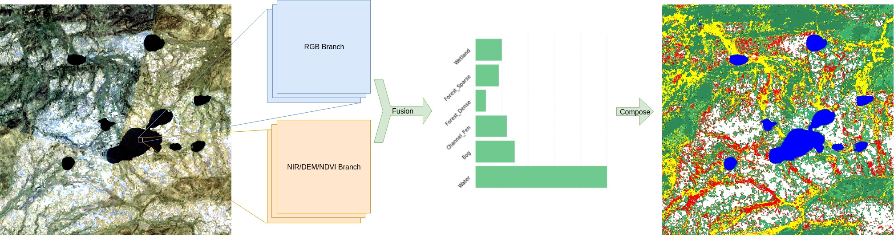

# ArcticNet: A Deep Learning Solution to Classify Arctic Wetlands

This repository contains the code and trained models for the work:<br/>
```
Ziyu Jiang Kate Von Ness Julie Loisel Zhangyang Wang
ArcticNet: A Deep Learning Solution to Classify Arctic Wetlands 
Published at CVPR 2019 Detecting Objects in Aerial Images Workshop
```



<!-- For other details, please refer to the [paper](https://arxiv.org/pdf/1711.09485.pdf). -->

If you find the code useful for your work, please consider citing

```
@article{jiang2019arcticnet,
  title={ArcticNet: A Deep Learning Solution to Classify Arctic Wetlands},
  author={Jiang, Ziyu and Von Ness, Kate and Loisel, Julie and Wang, Zhangyang},
  journal={arXiv preprint arXiv:1906.00133},
  year={2019}
}
``` 

Our dataset and trained model can be found [here](https://drive.google.com/drive/folders/1U_0J_gYkHQ6AdXOi98QxxBZ5nhcBDTrJ?usp=sharing).

## Prerequisite 
This code requires `Pytorch 1.0.0`, we only support single GPU. 

To install Pytorch, please refer to the docs at the [Pytorch website](http://pytorch.org/).

Other requirements contains `numpy, cv2, pyproj, shapefile, gdal, random, pandas`.

For installing `gdal`, you can consider `conda install -c conda-forge gdal`

## Data Preparation

For running the model, you need first download the [data](https://drive.google.com/drive/folders/1U_0J_gYkHQ6AdXOi98QxxBZ5nhcBDTrJ?usp=sharing).

Then you need to extract it and put the path of it in config file. Specifically, change the value after `ROOT:` with the /path/to/data/ in config/config_fuse.yaml and config/config_singleBranch.yaml.

## Testing

For testing, first download the pretrained [models](https://drive.google.com/drive/folders/1U_0J_gYkHQ6AdXOi98QxxBZ5nhcBDTrJ?usp=sharing). Create a folder named `checkpoint` and extract all the pretrained models into it. Form it as
```
ArcticNet
|--checkpoints
   |--rgbBranch
   |--ndnBranch
   |--fusenet_midFuse_layer3
   |--...
|--config
|--data
...
```
If testing single branch model. Change the EXPERIENT in config/config_singleBranch.yaml into the folder name of pretrained model and set `TESTON` as True. Then run:

 `python train_singleBranch.py`
 
 If testing fuse model. Change the EXPERIENT in config/config_fuse.yaml into the folder name of pretrained model and set `TESTON` as True. Then run:

 `python train_fuse.py`
 
 ## Training
 
 If train single branch model. Change the EXPERIENT in config/config_singleBranch.yaml into the name you like and set `TESTON`, `MAPGENEON` as False. Then run:

 `python train_singleBranch.py`
 
 If train fuse model. Change the EXPERIENT in config/config_fuse.yaml into the name you like and set `TESTON`, `MAPGENEON` as False. Then run:

 `python train_fuse.py`
 
 ## Semantic Map Generating
 
  If using single branch model. Change the EXPERIENT in config/config_singleBranch.yaml into pretrained model name you want to use and set `TESTON` as False, `MAPGENEON` as True. Then run:

 `python train_singleBranch.py`
 
 If using fuse model. Change the EXPERIENT in config/config_fuse.yaml into pretrained model name you want to use and set `TESTON` as False, `MAPGENEON` as True. Then run:

 `python train_fuse.py`